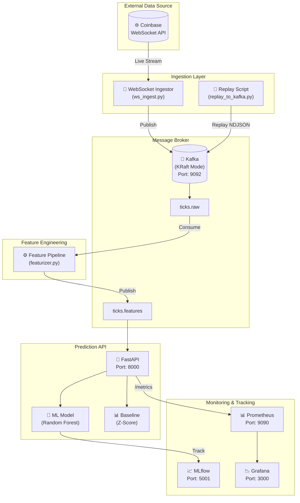
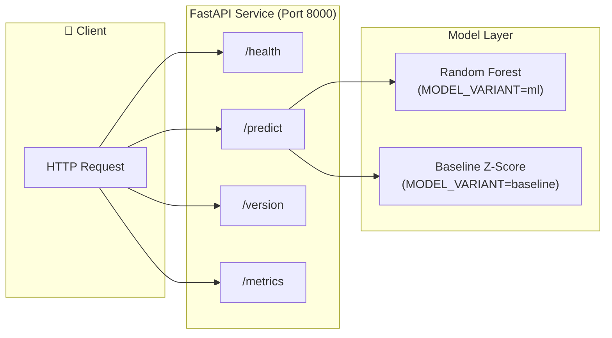
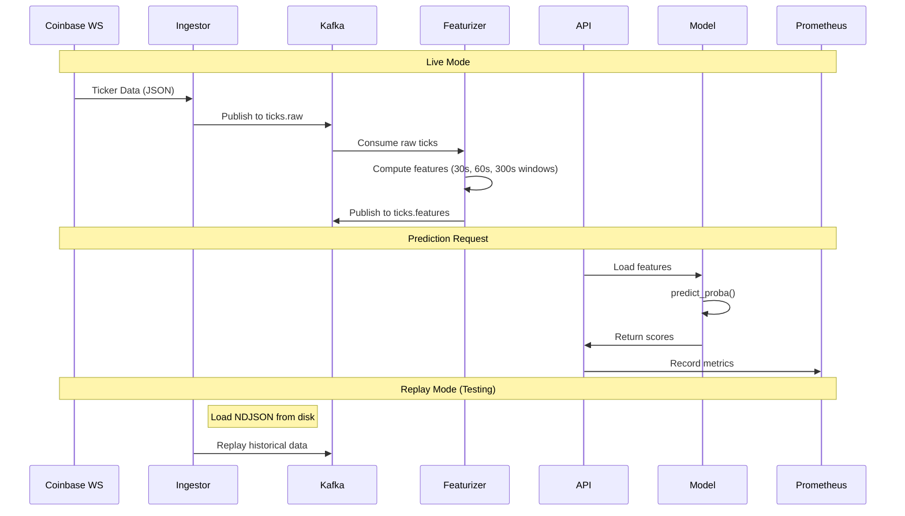

# System Architecture Diagram

## Week 4 - Real-Time Crypto AI Service Architecture

### High-Level System Overview



### Detailed Component Diagram



### Data Flow Diagram



### ASCII Architecture (for non-Mermaid viewers)

```
┌─────────────────────────────────────────────────────────────────┐
│                         DATA SOURCE                              │
│  ┌──────────────────────────────────────────────────────────┐   │
│  │         Coinbase WebSocket API                           │   │
│  │    (wss://advanced-trade-ws.coinbase.com)               │   │
│  └───────────────────────┬────────────────────────────────┘   │
└────────────────────────────┼──────────────────────────────────────┘
                             │
                             ▼
┌─────────────────────────────────────────────────────────────────┐
│                      INGESTION LAYER                             │
│  ┌──────────────────────────────────────────────────────────┐   │
│  │         Kafka Producer (scripts/ws_ingest.py)            │   │
│  │  • Subscribes to ticker channel                         │   │
│  │  • Publishes to Kafka topic: ticks.raw                  │   │
│  │  • Optional: Save to disk (NDJSON)                      │   │
│  └───────────────────────┬────────────────────────────────┘   │
└────────────────────────────┼──────────────────────────────────────┘
                             │
                             ▼
┌─────────────────────────────────────────────────────────────────┐
│                    MESSAGE BROKER (Kafka KRaft)                  │
│  ┌──────────────────────────────────────────────────────────┐   │
│  │         Kafka Broker (Port: 9092)                        │   │
│  │  Topics:                                                 │   │
│  │  • ticks.raw      (raw ticker data)                     │   │
│  │  • ticks.features (computed features)                   │   │
│  └───────────────────────┬────────────────────────────────┘   │
└────────────────────────────┼──────────────────────────────────────┘
                             │
                             ▼
┌─────────────────────────────────────────────────────────────────┐
│                    FEATURE ENGINEERING                           │
│  ┌──────────────────────────────────────────────────────────┐   │
│  │         Feature Pipeline (features/featurizer.py)       │   │
│  │  • Consumes from ticks.raw                              │   │
│  │  • Computes windowed features (30s, 60s, 300s)          │   │
│  │  • Publishes to ticks.features                          │   │
│  └───────────────────────┬────────────────────────────────┘   │
└────────────────────────────┼──────────────────────────────────────┘
                             │
                             ▼
┌─────────────────────────────────────────────────────────────────┐
│                    PREDICTION API (FastAPI)                      │
│  ┌──────────────────────────────────────────────────────────┐   │
│  │         api/app.py (Port: 8000)                         │   │
│  │                                                          │   │
│  │  Endpoints:                                              │   │
│  │  • GET  /health    → {"status": "healthy", ...}         │   │
│  │  • POST /predict   → {"scores": [...], ...}             │   │
│  │  • GET  /version   → {"model": "rf_v1", "sha": "..."}   │   │
│  │  • GET  /metrics   → Prometheus format                  │   │
│  │                                                          │   │
│  │  Models:                                                 │   │
│  │  • Random Forest (MODEL_VARIANT=ml) - PR-AUC: 0.9859   │   │
│  │  • Baseline Z-Score (MODEL_VARIANT=baseline)            │   │
│  └───────────────────────┬────────────────────────────────┘   │
└────────────────────────────┼──────────────────────────────────────┘
                             │
                             ▼
┌─────────────────────────────────────────────────────────────────┐
│                    MONITORING & TRACKING                         │
│  ┌──────────────────┐  ┌──────────────┐  ┌─────────────────┐   │
│  │    MLflow        │  │  Prometheus  │  │    Grafana      │   │
│  │    Port: 5001    │  │  Port: 9090  │  │    Port: 3000   │   │
│  │                  │  │              │  │                 │   │
│  │ • Model tracking │  │ • Latency    │  │ • Dashboards    │   │
│  │ • Experiments    │  │ • Requests   │  │ • Alerts        │   │
│  │ • Artifacts      │  │ • Errors     │  │ • SLOs          │   │
│  └──────────────────┘  └──────────────┘  └─────────────────┘   │
└─────────────────────────────────────────────────────────────────┘
```

## Component Details

### 1. Ingestion Layer
- **Component**: `scripts/ws_ingest.py`
- **Function**: Connects to Coinbase WebSocket, streams ticker data
- **Output**: Kafka topic `ticks.raw`
- **Optional**: Saves raw data to `data/raw/*.ndjson`

### 2. Message Broker
- **Component**: Kafka (KRaft mode or Zookeeper mode)
- **Port**: 9092
- **Topics**:
  - `ticks.raw`: Raw ticker data from Coinbase
  - `ticks.features`: Computed features ready for prediction
- **Modes**: 
  - KRaft (no Zookeeper): `docker compose -f compose-kraft.yaml up -d`
  - Zookeeper: `docker compose up -d`

### 3. Feature Engineering
- **Component**: `features/featurizer.py`
- **Function**: 
  - Consumes from `ticks.raw`
  - Computes windowed features (30s, 60s, 300s windows)
  - Publishes to `ticks.features`
  - Saves to parquet for batch processing
- **Features**: 10 features including returns, volatility, spreads, trade intensity

### 4. Prediction API
- **Component**: `api/app.py` (FastAPI)
- **Port**: 8000
- **Endpoints**:
  - `GET /health`: Service health check
  - `POST /predict`: Make predictions (Assignment API)
  - `GET /version`: API and model version info
  - `GET /metrics`: Prometheus metrics
- **Model**: Random Forest - PR-AUC 0.9859
- **Rollback**: `MODEL_VARIANT=baseline` for z-score fallback

### 5. Monitoring & Tracking
- **MLflow** (Port 5001): Model versioning, experiment tracking
- **Prometheus** (Port 9090): Metrics collection via `/metrics` endpoint
- **Grafana** (Port 3000): Dashboards and alerting

---

## API Contract

### POST /predict
```json
// Request
{"rows": [{"ret_mean": 0.05, "ret_std": 0.01, "n": 50}]}

// Response
{"scores": [0.74], "model_variant": "ml", "version": "v1.2", "ts": "2025-11-02T14:33:00Z"}
```

### GET /health
```json
{"status": "healthy", "timestamp": "2025-11-25T10:30:00Z", "model_loaded": true, "kafka_connected": true}
```

### GET /version
```json
{"model": "random_forest_v1", "sha": "abc123", "version": "v1.2", "model_variant": "ml"}
```

---

## Data Flow

### Live Mode
1. **Coinbase WS** → Ticker data → **Ingestor** → Kafka `ticks.raw`
2. **Feature Pipeline** → Consume raw → Compute features → `ticks.features`
3. **API** → Receive request → Load model → Predict → Return scores
4. **Monitoring** → Record latency/counts → Prometheus → Grafana

### Replay Mode (Testing)
1. **NDJSON file** → `replay_to_kafka.py` → Kafka `ticks.raw`
2. Same flow as live mode from step 2

---

## Deployment

### Quick Start (One Command)
```bash
cd docker && docker compose up -d
```

### Services Started
| Service | Container | Port | Purpose |
|---------|-----------|------|---------|
| Kafka | kafka | 9092 | Message broker |
| Zookeeper | zookeeper | 2182 | Kafka coordination |
| MLflow | mlflow-server | 5001 | Experiment tracking |
| API | volatility-api | 8000 | Prediction service |
| Prometheus | prometheus | 9090 | Metrics collection |
| Grafana | grafana | 3000 | Dashboards |

### Model Rollback
```bash
# Switch to ML model (default)
MODEL_VARIANT=ml docker compose up -d api

# Switch to baseline (rollback)
MODEL_VARIANT=baseline docker compose up -d api
```

---

## File Structure

```
├── api/app.py              # FastAPI prediction service
├── docker/
│   ├── compose.yaml        # Main Docker Compose (Zookeeper mode)
│   ├── compose-kraft.yaml  # Alternative (KRaft mode)
│   ├── Dockerfile.api      # API container
│   └── grafana/            # Grafana dashboards
├── features/featurizer.py  # Feature engineering
├── models/
│   ├── artifacts/          # Trained models
│   ├── train.py            # Training pipeline
│   └── infer.py            # Inference logic
├── scripts/
│   ├── ws_ingest.py        # WebSocket data ingestion
│   ├── replay.py           # Offline replay
│   └── replay_to_kafka.py  # Replay to Kafka
└── tests/                  # Integration tests
```

